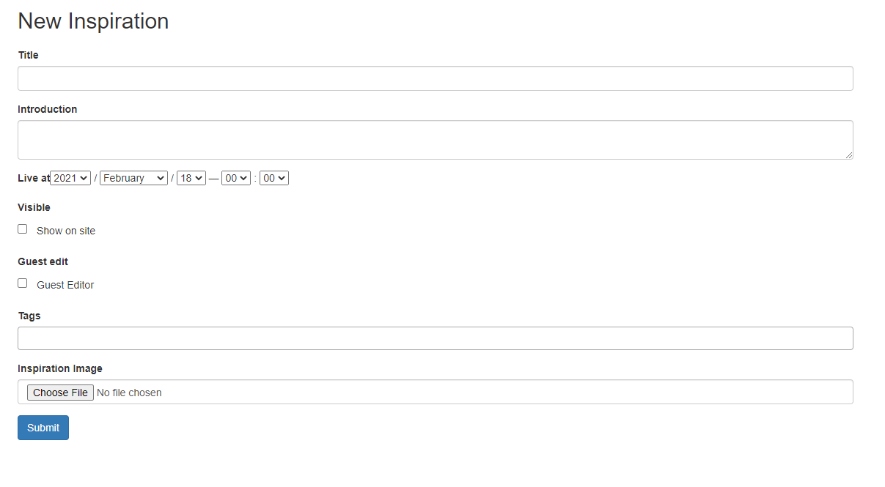
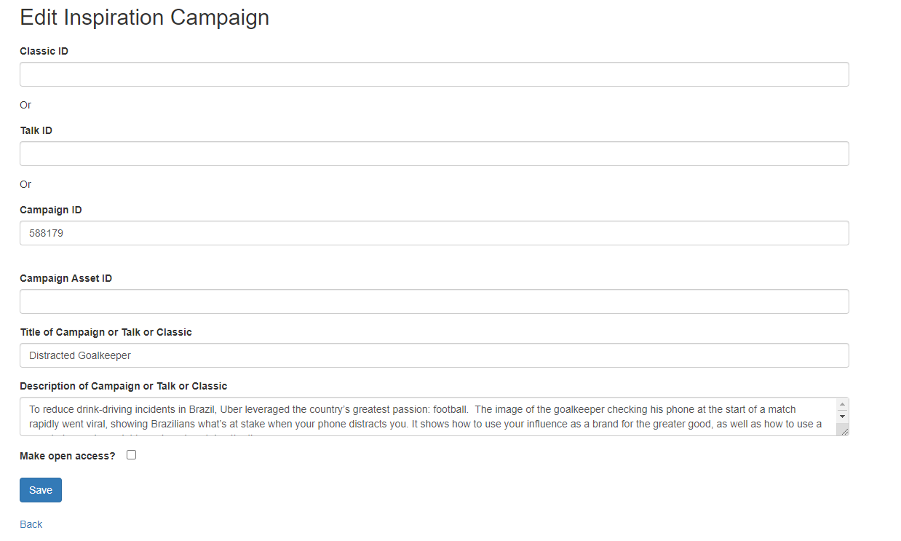

# Daily Inspirations

A command line project to automate the production of daily inspirations content on [lovethework.com](https://www.lovethework.com/) - the archive of work submitted to the Cannes Lions International Festival of Creativity.

The project uses the Selenium webdriver to interact with the lovethework CMS (Gemini).

# Process

Text data for each Daily Inspiration collection is extracted from a word document, converted into html to parse the information and then passed to the Selenium webdriver as a dictionary object.

The webdriver submits the data to two forms.

### First form

<kbd></kbd>

### Second Form

<kbd></kbd>

# Improvements

- made ability to pass in directory of zip files so only have to use one cms instance

### ToDo

- fix tick visible box for each when iterating over zip files
- add clear boxes in cms when making each new inspiration
- add check links for /talks or /campaigns etc to know which ID to input
- find way to open access / guest edit each inspiration